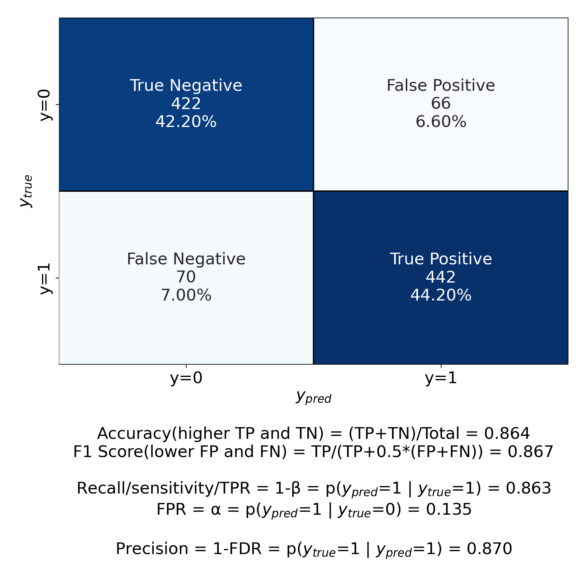

===============================
Machine Learning Python Library
===============================

Install

.. code-block:: bash

   pip install machlearn

-----

Example

.. code-block:: python
   
   from machlearn import model_evaluation as me
   me.test()

-----

module: model_evaluation

.. csv-table::
   :header: "function", "description"
   :widths: 10, 20

   "plot_confusion_matrix()", "plots the confusion matrix, along with key statistics"
   "plot_ROC_curve()", "plots the ROC (Receiver Operating Characteristic) curve, along with statistics"
   "plot_PR_curve()", "plots the precision-recall curve, along with statistics"
   "plot_ROC_and_PR_curves()", "plots both the ROC and the precision-recall curves, along with statistics"
   "test()", "tests all the functions in this module"

module: naive_bayes

.. csv-table::
   :header: "function", "description"
   :widths: 10, 20

   "naive_bayes_Bernoulli()", "when X are independent binary variables (e.g., whether a word occurs in a document or not)"
   "naive_bayes_multinomial()", "when X are independent discrete variables with 3+ levels (e.g., term frequency in the document)"
   "naive_bayes_Gaussian()", "when X are continuous variables"
